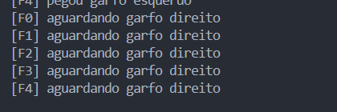
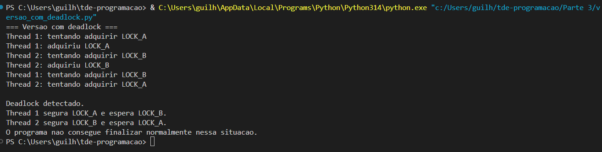
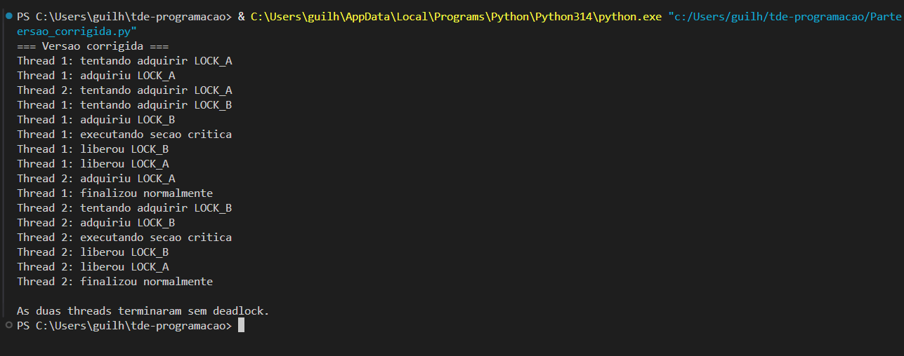

Nome do grupo e dos integrantes:

- Guilherme Camargo Rocha dos Santos
- Joao Vitor Pereira da Silva

Linguagem escolhida:

- Python

---------------------------------------------------------------------------------------------

Parte 1 - Jantar dos Filosofos (Versao Ingenua)
Responsavel: Joao Vitor Pereira da Silva

Objetivo:

- Fazer a implementacao do jantar dos filosofos usando threads com Python.
- Simular a forma ingenua, em que cada filosofo tenta pegar primeiro o garfo da esquerda e depois o garfo da direita.
- Demonstrar que essa estrategia pode resultar em deadlock.

Implementacao:

- Cada filosofo foi representado por uma thread.
- Cada garfo foi representado por um `threading.Lock()`.
- O ciclo de cada filosofo e: pensar, ficar com fome, tentar pegar os dois garfos, comer, liberar os garfos e voltar a pensar.
- Todos seguem a mesma ordem: primeiro o garfo esquerdo e depois o direito.
- Foi usado `time.sleep(0.05)` entre os `acquire()` para aumentar a chance de todos pegarem o primeiro garfo antes de tentar pegar o segundo.

Por que o deadlock surge:

- O deadlock surge porque todos os filosofos podem pegar o garfo esquerdo ao mesmo tempo.
- Depois disso, cada um fica esperando o garfo direito, que esta com o proximo filosofo.
- Como nenhum filosofo libera o garfo que ja pegou, todos ficam bloqueados.

As 4 condicoes de Coffman:

- Exclusao mutua: cada garfo so pode estar com um filosofo por vez. Isso e garantido pelo `threading.Lock()`.
- Manter e esperar: o filosofo segura o garfo esquerdo enquanto espera o direito.
- Nao preempcao: nenhum filosofo consegue tirar o garfo da mao de outro a forca. O garfo so e liberado com `release()`.
- Espera circular: F0 espera F1, F1 espera F2, F2 espera F3, F3 espera F4 e F4 espera F0.

Pseudocodigo:

```text
para cada filosofo i:
    pensar()
    estado[i] = "com fome"
    adquirir(garfo_esquerdo)
    adquirir(garfo_direito)
    estado[i] = "comendo"
    comer()
    liberar(garfo_direito)
    liberar(garfo_esquerdo)
    estado[i] = "pensando"
```

Print do terminal travado:



Como rodar:

```powershell
python "parte1-filósofos\FilosofosVerIngenua.py"
```

---------------------------------------------------------------------------------------------

Parte 3 - Deadlock com Threads e Locks
Responsavel: Guilherme Camargo Rocha dos Santos

Objetivo:

- Demonstrar, de forma pratica, como um deadlock acontece em um programa concorrente.
- Criar uma versao com deadlock usando duas threads e dois locks.
- Criar uma versao corrigida usando hierarquia de recursos, tambem chamada de ordem global de aquisicao.
- Relacionar o problema com as quatro condicoes de Coffman.

Implementacao da versao com deadlock:

- Foram criados dois locks: `LOCK_A` e `LOCK_B`.
- A `Thread 1` tenta adquirir primeiro o `LOCK_A` e depois o `LOCK_B`.
- A `Thread 2` tenta adquirir primeiro o `LOCK_B` e depois o `LOCK_A`.
- Foi usado `time.sleep(PAUSA_SEGUNDOS)` entre a primeira e a segunda tentativa de aquisicao.
- Os logs mostram quando cada thread tenta adquirir e quando consegue adquirir cada lock.

Por que o deadlock surge:

- A `Thread 1` segura o `LOCK_A` e fica esperando o `LOCK_B`.
- A `Thread 2` segura o `LOCK_B` e fica esperando o `LOCK_A`.
- Nenhuma das duas consegue continuar, porque cada uma espera um recurso que esta preso com a outra.

Implementacao da versao corrigida:

- As duas threads seguem a mesma ordem de aquisicao dos locks.
- A regra usada foi: sempre adquirir `LOCK_A` antes de `LOCK_B`.
- A liberacao dos locks acontece automaticamente com `with LOCK_A` e `with LOCK_B`.
- Como todas as threads seguem a mesma ordem, a espera circular deixa de existir.

As 4 condicoes de Coffman na Parte 3:

- Exclusao mutua: cada lock so pode estar com uma thread por vez.
- Manter e esperar: na versao com deadlock, uma thread segura um lock enquanto espera o outro.
- Nao preempcao: uma thread nao consegue forcar a outra a liberar um lock.
- Espera circular: a `Thread 1` espera a `Thread 2`, e a `Thread 2` espera a `Thread 1`.

Condicao quebrada na correcao:

- A correcao quebra a espera circular.
- Quando todas as threads seguem a ordem `LOCK_A -> LOCK_B`, nao existe mais ciclo de espera.

Pseudocodigo da versao com deadlock:

```text
Thread 1:
    adquirir(LOCK_A)
    esperar()
    adquirir(LOCK_B)

Thread 2:
    adquirir(LOCK_B)
    esperar()
    adquirir(LOCK_A)
```

Pseudocodigo da versao corrigida:

```text
Thread 1:
    adquirir(LOCK_A)
    adquirir(LOCK_B)
    executar_secao_critica()
    liberar(LOCK_B)
    liberar(LOCK_A)

Thread 2:
    adquirir(LOCK_A)
    adquirir(LOCK_B)
    executar_secao_critica()
    liberar(LOCK_B)
    liberar(LOCK_A)
```

Como rodar:

```powershell
python "Parte 3\versao_com_deadlock.py"
python "Parte 3\versao_corrigida.py"
```







Conclusao:

- A versao com deadlock trava porque as threads usam ordem oposta de aquisicao dos locks.
- A versao corrigida termina normalmente porque todas as threads seguem a mesma ordem de aquisicao.
- A estrategia usada na correcao foi a hierarquia de recursos.

---------------------------------------------------------------------------------------------
