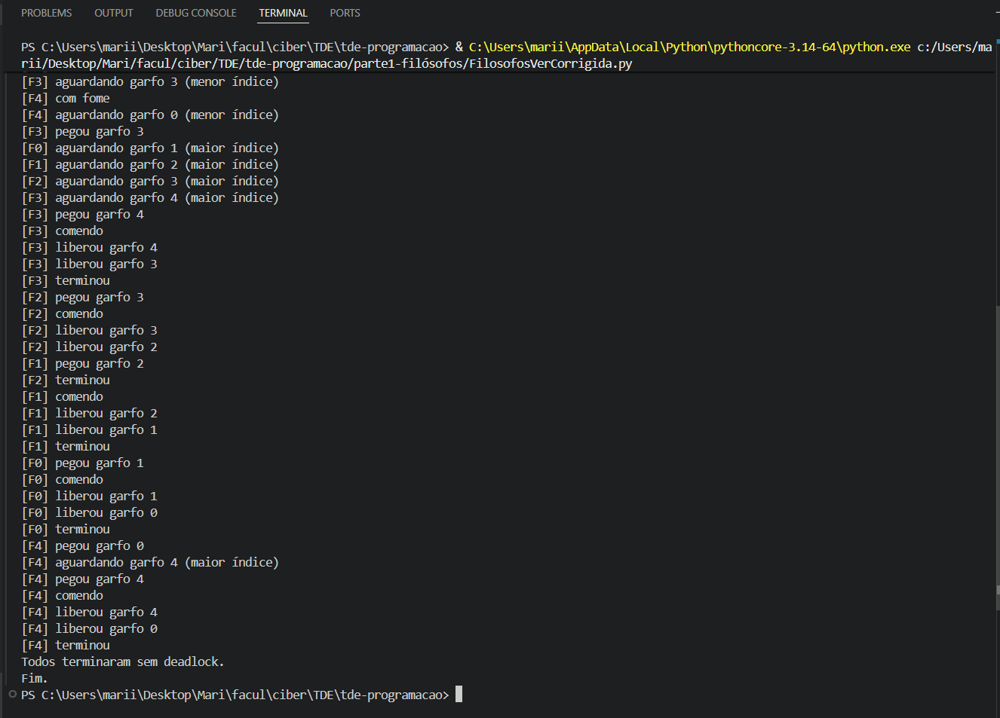
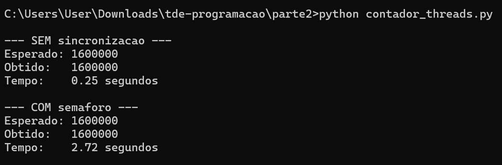
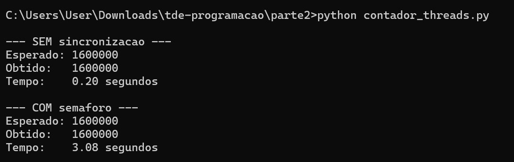
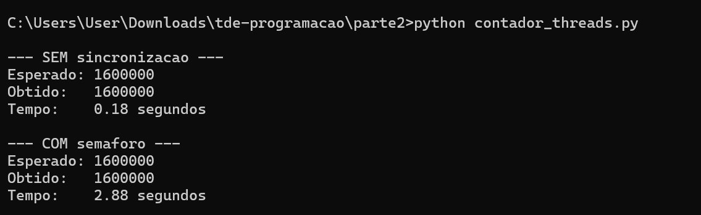

Nome do grupo e dos integrantes:

- Joao Vitor Pereira da Silva
- Matheus Pamplona Martins
- Guilherme Camargo Rocha dos Santos
- Mariana Mazur Lôr Dambrós

Linguagem escolhida:

- Python

---------------------------------------------------------------------------------------------

Parte 1 - Jantar dos Filosofos (Versao Ingenua)
Responsavel: Joao Vitor Pereira da Silva

Objetivo:

- Fazer a implementacao do jantar dos filosofos usando threads com Python.
- Simular a forma ingenua, em que cada filosofo tenta pegar primeiro o garfo da esquerda e depois o garfo da direita.
- Demonstrar que essa estrategia pode resultar em deadlock.

Implementacao:

- Cada filosofo foi representado por uma thread.
- Cada garfo foi representado por um `threading.Lock()`.
- O ciclo de cada filosofo e: pensar, ficar com fome, tentar pegar os dois garfos, comer, liberar os garfos e voltar a pensar.
- Todos seguem a mesma ordem: primeiro o garfo esquerdo e depois o direito.
- Foi usado `time.sleep(0.05)` entre os `acquire()` para aumentar a chance de todos pegarem o primeiro garfo antes de tentar pegar o segundo.

Por que o deadlock surge:

- O deadlock surge porque todos os filosofos podem pegar o garfo esquerdo ao mesmo tempo.
- Depois disso, cada um fica esperando o garfo direito, que esta com o proximo filosofo.
- Como nenhum filosofo libera o garfo que ja pegou, todos ficam bloqueados.

As 4 condicoes de Coffman:

- Exclusao mutua: cada garfo so pode estar com um filosofo por vez. Isso e garantido pelo `threading.Lock()`.
- Manter e esperar: o filosofo segura o garfo esquerdo enquanto espera o direito.
- Nao preempcao: nenhum filosofo consegue tirar o garfo da mao de outro a forca. O garfo so e liberado com `release()`.
- Espera circular: F0 espera F1, F1 espera F2, F2 espera F3, F3 espera F4 e F4 espera F0.

Pseudocodigo:

```text
para cada filosofo i:
    pensar()
    estado[i] = "com fome"
    adquirir(garfo_esquerdo)
    adquirir(garfo_direito)
    estado[i] = "comendo"
    comer()
    liberar(garfo_direito)
    liberar(garfo_esquerdo)
    estado[i] = "pensando"
```

Print do terminal travado:


Como rodar:

```powershell
python "parte1-filósofos\FilosofosVerIngenua.py"
```

---------------------------------------------------------------------------------------------

Parte 1 - Jantar dos Filosofos (Versao Corrigida)
Responsavel: Mariana Mazur Lôr Dambrós

Objetivo:

- Fazer a implementacao do jantar dos filosofos usando threads com Python, agora sem deadlock.
- SAplicar a estrategia de hierarquia de recursos para eliminar a espera circular.
- Demonstrar que todos os filosofos conseguem comer e o programa termina corretamente.

Implementacao:

- Cada filosofo foi representado por uma thread.
- Cada garfo foi representado por um `threading.Lock()`.
- O ciclo de cada filosofo e: pensar, ficar com fome, tentar pegar os dois garfos na ordem correta, comer, liberar os garfos e voltar a pensar.
- Em vez de sempre pegar o garfo esquerdo primeiro, cada filosofo calcula `primeiro = min(esq, dir)` e `segundo = max(esq, dir)`, garantindo que o garfo de menor indice seja sempre adquirido antes.
- Foi usado `time.sleep(0.05)` entre os `acquire()` para manter o comportamento semelhante a versao ingenua e evidenciar que mesmo assim nao ocorre deadlock.

Por que o deadlock não surge:

- Todos os filosofos seguem a mesma ordem global de aquisicao: primeiro o garfo de menor indice, depois o de maior indice.
- O filosofo F4, por exemplo, tem garfos 4 (esquerdo) e 0 (direito). Pela regra, ele precisa pegar o garfo 0 primeiro.
- Isso faz com que F0 e F4 concorram pelo garfo 0. So um deles consegue, e o outro espera sem segurar nenhum recurso.
- Sem ciclo de espera, o deadlock nao pode ocorrer.

Condicao de Coffman negada:

- Espera circular: quebrada pela ordem global de aquisicao. Nao e possivel formar um ciclo em que F0 espera F1, F1 espera F2 e assim por diante, pois a ordem imposta impede que todos segurem um garfo e esperem o do vizinho ao mesmo tempo.
- As outras tres condicoes (exclusao mutua, manter e esperar, nao preempcao) continuam presentes, mas sem a espera circular o deadlock nao pode se formar.

Pseudocodigo:

```text
para cada filosofo i:
    esq = i
    dir = (i + 1) mod N
    primeiro = min(esq, dir)
    segundo  = max(esq, dir)

    pensar()
    estado[i] = "com fome"
    adquirir(garfo[primeiro])
    adquirir(garfo[segundo])
    estado[i] = "comendo"
    comer()
    liberar(garfo[segundo])
    liberar(garfo[primeiro])
    estado[i] = "pensando"
```

Print do terminal travado:



Como rodar:

```powershell
python "parte1-filósofos\FilosofosVerCorrigida.py"
```
---------------------------------------------------------------------------------------------

Parte 2 - Threads e Semaforos
Responsavel: Matheus Pamplona Martins

Objetivo:

- Demonstrar uma condicao de corrida incrementando um contador compartilhado a partir de multiplas threads sem sincronizacao.
- Corrigir o problema utilizando um semaforo binario.
- Comparar o valor final e o tempo de execucao das duas versoes.

Implementacao:

- Um contador compartilhado `contador` foi incrementado por `NUM_THREADS = 8` threads, cada uma realizando `NUM_ITERACOES = 200.000` incrementos.
- A versao sem sincronizacao acessa o contador diretamente, sem nenhum controle de acesso.
- A versao com semaforo utiliza `threading.Semaphore(1)` para garantir que apenas uma thread por vez execute o incremento.
- O tempo de execucao de cada versao foi medido com `time.time()`.

Por que a condicao de corrida surge:

- A operacao `contador = contador + 1` e feita em etapas: ler o valor atual, somar 1 e salvar o resultado.
- Quando duas threads leem o mesmo valor antes que qualquer uma salve, ambas calculam o mesmo resultado e uma das atualizacoes e sobrescrita.
- Os incrementos se "atropelam" e o valor final acaba sendo menor do que o esperado.

Por que a versao com semaforo e correta:

- O semaforo binario garante que apenas uma thread por vez execute a secao critica.
- Antes de incrementar, a thread chama `sem.acquire()`, que bloqueia caso outra thread ja esteja dentro da secao critica.
- Ao terminar, chama `sem.release()`, liberando a passagem para a proxima.
- Dessa forma, nenhum incremento e perdido, cada thread le o valor correto e atualizado do contador.

Observacao sobre o GIL:

- A condicao de corrida nao ficou evidente nos resultados porque o Python possui o GIL (Global Interpreter Lock), que impede que duas threads executem bytecode simultaneamente.
- Em operacoes simples como o incremento de um inteiro, o GIL acaba protegendo o contador mesmo sem semaforo.
- O proprio enunciado do trabalho alerta para essa caracteristica do Python e sugere operacoes suficientemente custosas para que a corrida seja visivel.

Trade-off de throughput:

- A correcao tem um custo: a versao com semaforo e significativamente mais lenta.
- Isso acontece porque as threads deixam de trabalhar em paralelo na secao critica, passando a executar os incrementos de forma sequencial; cada uma esperando sua vez.
- Quanto maior o numero de threads e incrementos, maior o tempo gasto em espera.

Visibilidade e ordenacao (happens-before e barreiras implicitas):

- Quando uma thread libera o semaforo com `sem.release()`, e garantido que todas as alteracoes que ela fez na memoria antes desse ponto sejam visiveis para a proxima thread que chamar `sem.acquire()`.
- Esse conceito e chamado de happens-before: tudo que acontece antes do release e garantidamente visto apos o acquire.
- Em Python, o semaforo funciona como uma barreira implicita de memoria, assegurando que o valor do contador lido por cada thread seja sempre o valor correto e atualizado.

Pseudocodigo:

```text
Globais:
    contador = 0
    sem = Semaforo(permissoes = 1)

Funcao tarefa_sem_sincronizacao():
    para i de 1 ate NUM_ITERACOES:
        contador = contador + 1

Funcao tarefa_com_sincronizacao():
    para i de 1 ate NUM_ITERACOES:
        sem.adquirir()
        contador = contador + 1
        sem.liberar()

Programa principal:
    iniciar NUM_THREADS threads executando tarefa_sem_sincronizacao()
    esperar todas terminarem
    imprimir esperado = NUM_THREADS*NUM_ITERACOES, obtido = contador, tempo = ...

    iniciar NUM_THREADS threads executando tarefa_com_sincronizacao()
    esperar todas terminarem
    imprimir esperado = NUM_THREADS*NUM_ITERACOES, obtido = contador, tempo = ...
```

Tabela de resultados:

| Execucao | Versao              | Esperado  | Obtido    | Tempo  |
|----------|---------------------|-----------|-----------|--------|
| 1        | Sem sincronizacao   | 1.600.000 | 1.600.000 | 0,25s  |
| 1        | Com semaforo        | 1.600.000 | 1.600.000 | 2,72s  |
| 2        | Sem sincronizacao   | 1.600.000 | 1.600.000 | 0,20s  |
| 2        | Com semaforo        | 1.600.000 | 1.600.000 | 3,08s  |
| 3        | Sem sincronizacao   | 1.600.000 | 1.600.000 | 0,18s  |
| 3        | Com semaforo        | 1.600.000 | 1.600.000 | 2,88s  |

Print do terminal:





Como rodar:

```powershell
python "Parte 2\contador_threads.py"
```
---------------------------------------------------------------------------------------------


Parte 3 - Deadlock com duas threads
Responsavel: Guilherme Camargo Rocha dos Santos

Objetivo:

- Fazer um exemplo simples de deadlock usando threads em Python.
- Usar dois locks, chamados `LOCK_A` e `LOCK_B`.
- Mostrar uma versao que trava e uma versao corrigida.

Implementacao da versao com deadlock:

- Foram criadas duas threads.
- A Thread 1 pega primeiro o `LOCK_A` e depois tenta pegar o `LOCK_B`.
- A Thread 2 pega primeiro o `LOCK_B` e depois tenta pegar o `LOCK_A`.
- Tem um `time.sleep(0.3)` entre os dois `acquire()`, para dar tempo das duas threads pegarem o primeiro lock.
- Depois disso, cada uma fica esperando o lock que esta com a outra.

Por que trava:

- A Thread 1 fica segurando o `LOCK_A` e esperando o `LOCK_B`.
- A Thread 2 fica segurando o `LOCK_B` e esperando o `LOCK_A`.
- Como nenhuma libera o lock que ja pegou, o programa fica parado e nao chega no `Fim`.

As 4 condicoes de Coffman:

- Exclusao mutua: cada lock so pode estar com uma thread por vez.
- Manter e esperar: cada thread segura um lock enquanto espera o outro.
- Nao preempcao: uma thread nao consegue forcar a outra a liberar o lock.
- Espera circular: a Thread 1 espera a Thread 2, e a Thread 2 espera a Thread 1.

Versao corrigida:

- Na versao corrigida, as duas threads seguem a mesma ordem.
- As duas pegam primeiro o `LOCK_A` e depois o `LOCK_B`.
- Assim uma thread pode esperar, mas nao fica segurando `LOCK_B` enquanto espera `LOCK_A`.
- A condicao quebrada foi a espera circular.

Pseudocodigo da versao com deadlock:

```text
Thread 1:
    pega LOCK_A
    espera um pouco
    tenta pegar LOCK_B

Thread 2:
    pega LOCK_B
    espera um pouco
    tenta pegar LOCK_A
```

Pseudocodigo da versao corrigida:

```text
Thread 1:
    pega LOCK_A
    pega LOCK_B
    libera LOCK_B
    libera LOCK_A

Thread 2:
    pega LOCK_A
    pega LOCK_B
    libera LOCK_B
    libera LOCK_A
```

Como rodar:

```powershell
python "parte3\versao_com_deadlock.py"
python "parte3\versao_corrigida.py"
```

Na versao com deadlock, o terminal vai ficar parado. Para sair, use `Ctrl + C`.

Print da versao com deadlock:


Print da versao corrigida:


Prints necessarios para a atividade:

- Print da versao com deadlock mostrando a Thread 1 pegando `LOCK_A`.
- Print da versao com deadlock mostrando a Thread 2 pegando `LOCK_B`.
- Print da versao com deadlock mostrando a Thread 1 tentando pegar `LOCK_B` e a Thread 2 tentando pegar `LOCK_A`.
- Print do terminal parado, mostrando que a versao com deadlock nao finaliza.
- Print da versao corrigida mostrando que as duas threads terminaram sem deadlock.

Conclusao:

- A primeira versao trava porque as threads pegam os locks em ordem contraria.
- A segunda versao funciona porque as duas seguem a mesma ordem: `LOCK_A` e depois `LOCK_B`.

---------------------------------------------------------------------------------------------
